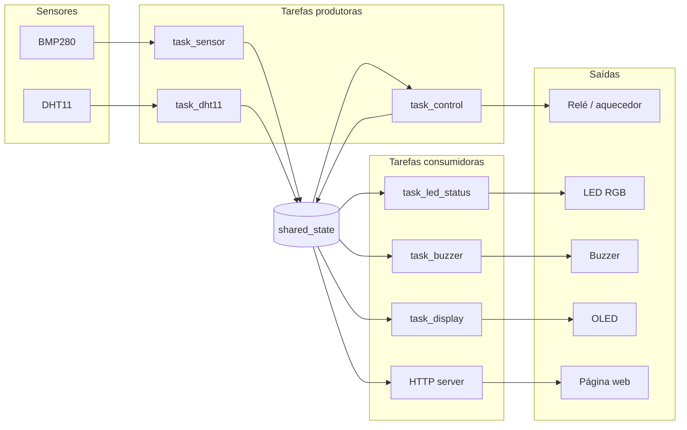

# Arquitetura

O firmware é organizado em **duas camadas** e um **ponto único de estado**. A ideia central é
o **desacoplamento**: os drivers não sabem nada de incubadora, e as tarefas não conversam
diretamente entre si — tudo passa pelo `shared_state`.

## Camadas

| Camada | Pasta | Responsabilidade |
|---|---|---|
| **Componentes** | `incubadora/components/` | Drivers de hardware reutilizáveis (`bme280`, `dht11`, `ssd1306_display`, `rgb_led`, `buzzer`, `rele`) — só falam com o dispositivo, sem regra de negócio |
| **Aplicação** | `incubadora/main/` | As tarefas do FreeRTOS, o estado compartilhado e a configuração (`app_config.h`) — a lógica da incubadora |

## Fluxo de dados

## Estado compartilhado (`shared_state`)

O `shared_state` é a **única fonte de verdade** do sistema. Ele guarda a leitura atual
(temperatura, pressão, umidade e o estado do aquecedor) protegida por um **mutex**, de forma
que várias tarefas possam ler e escrever ao mesmo tempo sem conflito.

Como **dois sensores** publicam no mesmo estado, ele usa **escritores segmentados** — cada
produtor atualiza só a sua parte, sem sobrescrever o dado dos outros:

- `shared_state_set_env(...)` → temperatura e pressão (do BMP280);
- `shared_state_set_humidity(...)` → umidade (do DHT11);
- `shared_state_set_heater(...)` → estado do aquecedor (da `task_control`).

As tarefas consumidoras chamam `shared_state_get(...)` e `compute_status(...)` para decidir a
cor do LED, o buzzer, o texto do OLED e o JSON da página web.

## Por que assim

- **Desacoplamento** — trocar um sensor ou um pino não afeta as outras tarefas; muda-se só o
  driver ou o `app_config.h`.
- **Concorrência segura** — o mutex evita corridas de dados entre as tarefas.
- **Reuso** — cada componente é um driver isolado, que pode ser levado para outro projeto.

!!! note "Inicialização"
    No boot, o `app_main()` sobe nesta ordem: estado compartilhado → atuadores em estado
    seguro (aquecedor desligado, buzzer mudo) → sensores → Wi-Fi/HTTP → e por fim cria as
    tarefas. Assim o aquecedor nunca liga antes de o controle estar no ar.
