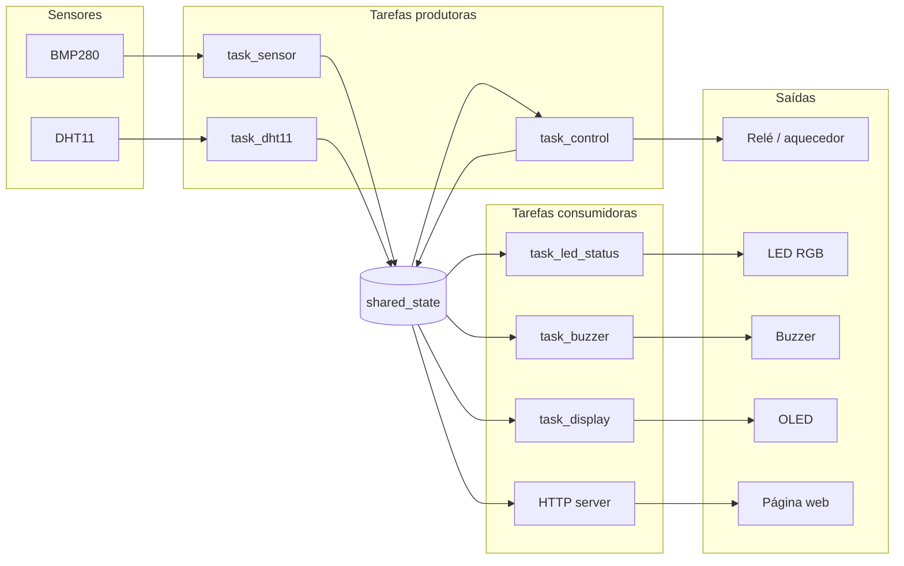

# Arquitetura

O firmware é organizado em **duas camadas** e um **ponto único de estado**. A ideia central é
o **desacoplamento**: os drivers de hardware não sabem nada sobre incubadora, e as tarefas não
conversam diretamente entre si — tudo passa por um estado compartilhado. Assim, cada parte
pode ser entendida, testada e trocada isoladamente.

## Camadas

| Camada | Pasta | Responsabilidade |
|---|---|---|
| **Componentes** | `incubadora/components/` | Drivers de hardware reutilizáveis (`bme280`, `dht11`, `ssd1306_display`, `rgb_led`, `buzzer`, `rele`) — só falam com o dispositivo, sem regra de negócio |
| **Aplicação** | `incubadora/main/` | As tarefas do FreeRTOS, o estado compartilhado e a configuração (`app_config.h`) — a lógica da incubadora |

A fronteira entre as duas é clara: um componente **nunca** decide *quando* ligar o aquecedor;
ele só sabe *como* ligá-lo. Quem decide é uma tarefa da aplicação. Por isso o mesmo driver de
relé serviria para qualquer outro projeto.

## Fluxo de dados

O caminho é sempre o mesmo: os sensores alimentam as tarefas produtoras, que **escrevem** no
`shared_state`; as tarefas consumidoras **leem** desse estado e comandam as saídas. A
`task_control` é ao mesmo tempo consumidora (lê a temperatura) e produtora (publica o estado
do aquecedor de volta), por isso aparece com uma seta nos dois sentidos.

## Estado compartilhado (`shared_state`)

O `shared_state` é a **única fonte de verdade** do sistema. Ele guarda a leitura atual —
temperatura, pressão, umidade e o estado do aquecedor — em uma estrutura protegida por um
**mutex** (um "cadeado" que garante que só uma tarefa mexa no dado por vez). Sem esse cuidado,
duas tarefas escrevendo ao mesmo tempo poderiam deixar o valor corrompido.

Como **dois sensores** publicam no mesmo estado, ele usa **escritores segmentados** — cada
produtor atualiza só a sua parte, sem apagar o dado dos outros:

- `shared_state_set_env(...)` → temperatura e pressão (do BMP280);
- `shared_state_set_humidity(...)` → umidade (do DHT11);
- `shared_state_set_heater(...)` → estado do aquecedor (da `task_control`).

As tarefas consumidoras chamam `shared_state_get(...)` para pegar uma **cópia** consistente do
estado, e `compute_status(...)` para traduzir a temperatura em situação (ideal, alerta,
alarme...). Com isso decidem a cor do LED, o buzzer, o texto do OLED e o JSON da web.

??? info "Detalhe técnico — mutex e leitura consistente"
    O mutex é um `SemaphoreHandle_t` criado com `xSemaphoreCreateMutex()`. Toda leitura e
    escrita acontece entre `xSemaphoreTake` e `xSemaphoreGive`. O `shared_state_get` copia a
    estrutura inteira de uma vez para uma variável local da tarefa, de modo que ela trabalhe
    com um **retrato coerente** — sem risco de ler temperatura de um instante e umidade de
    outro. Os escritores segmentados evitam o problema clássico de um produtor "zerar" o campo
    de outro só porque reescreveu a estrutura toda.

## Inicialização segura

A ordem em que o sistema sobe importa por causa dos atuadores. No boot, o `app_main()` segue
esta sequência:

1. inicializa o **estado compartilhado** (mutex);
2. coloca os **atuadores em estado seguro** — aquecedor **desligado** e buzzer **mudo**;
3. inicializa os **sensores** e o display;
4. sobe o **Wi-Fi** e o **servidor HTTP**;
5. por fim, **cria as tarefas**.

Assim o **aquecedor nunca liga sozinho** antes de a `task_control` estar no ar para
supervisioná-lo.

## Por que essa organização

- **Desacoplamento** — trocar um sensor, um pino ou um limite não afeta as outras tarefas;
  muda-se apenas o driver ou o `app_config.h`.
- **Concorrência segura** — o mutex elimina as condições de corrida entre tarefas que rodam
  em paralelo (inclusive nos dois núcleos do ESP32).
- **Reuso** — cada componente é um driver isolado, que pode ser aproveitado em outros
  projetos sem arrastar a lógica da incubadora junto.
- **Clareza** — lendo só o `main/`, entende-se o comportamento do sistema; lendo só um
  componente, entende-se um periférico. As responsabilidades não se misturam.
