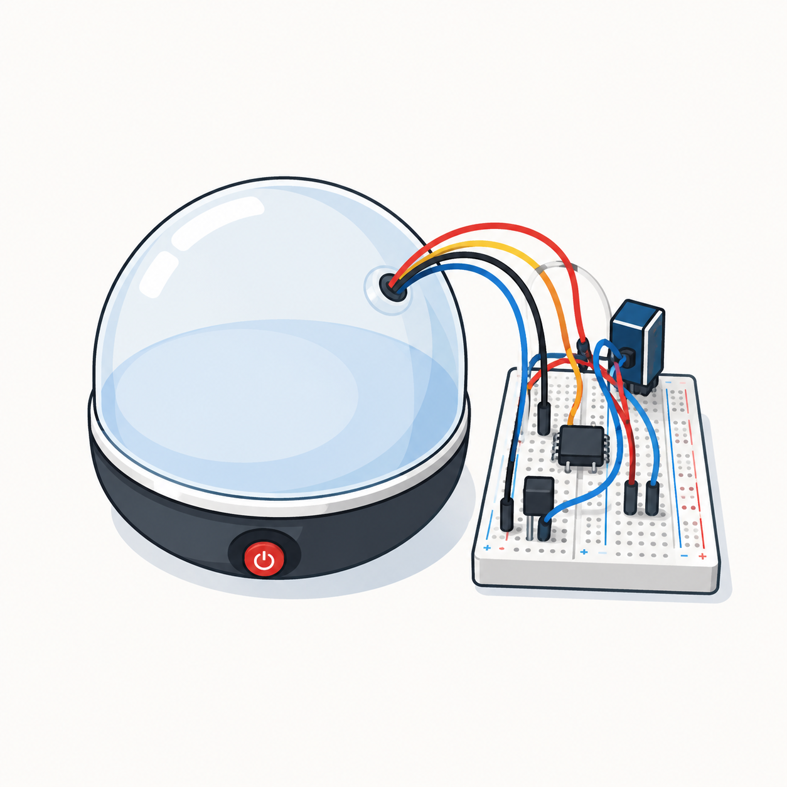

<h1>🐣 Incubadora Inteligente</h1>

Firmware em ESP32 · ESP-IDF

<b>Monitoramento de temperatura e umidade, com controle do aquecedor, alarme sonoro/visual e página web.</b>

Esta documentação descreve o firmware da incubadora desenvolvido em <b>ESP32</b> com o
framework <b>ESP-IDF</b>. O objetivo é ser direto e, ao mesmo tempo, completo: mostrar quais
<b>componentes</b> de hardware são usados e em que pino da ESP cada um está ligado, quais são
as <b>funções</b> (tarefas) que compõem o sistema e o que cada uma faz, e como a
<b>arquitetura</b> integra tudo de forma organizada e segura.

 

<a class="md-button md-button--primary" href="02-produto/componentes/">📦 Ver Componentes</a>

<a class="md-button" href="https://github.com/FGA-FSE/Trabalho-3-Mayara-Raquel">GitHub</a>

---

# 📋 Visão Geral

A incubadora precisa manter, dentro da câmara, uma **temperatura** e uma **umidade**
adequadas ao desenvolvimento dos ovos. Para isso, o firmware faz três coisas o tempo todo:
**mede** o ambiente, **mostra** essas informações e **age** sobre o aquecedor para corrigir a
temperatura quando ela sai do ponto desejado.

Na prática, o sistema lê a temperatura e a pressão com o sensor **BMP280** e a umidade com o
**DHT11**; exibe os valores em um **display OLED** e em uma **página web** acessível pelo
celular; sinaliza a situação com um **LED RGB** (verde quando está tudo bem, vermelho quando
sai da faixa) e um **buzzer** de alarme; e liga ou desliga um **aquecedor** através de um
**relé**, mantendo a temperatura numa faixa estreita.

Cada uma dessas responsabilidades é uma **tarefa** independente rodando sobre o
**FreeRTOS** (o sistema operacional de tempo real embutido no ESP-IDF). As tarefas não
conversam diretamente entre si: todas trocam informação por um **estado compartilhado**
protegido, o que mantém o código organizado e evita conflitos de acesso.

??? info "Detalhe técnico — por que FreeRTOS e estado compartilhado"
    O ESP32 é *dual-core* e o ESP-IDF já traz o **FreeRTOS** como escalonador. Em vez de um
    único laço gigante (`while(1)`) fazendo tudo, o firmware cria **tarefas** com prioridades
    e períodos próprios — ler sensor, controlar aquecedor, atualizar display, etc. Isso deixa
    cada parte simples e independente.

    O ponto delicado é que várias tarefas acessam **o mesmo dado** (a última leitura). Se duas
    mexerem ao mesmo tempo, o valor pode corromper (condição de corrida). Por isso existe o
    `shared_state`: uma estrutura única protegida por **mutex** (semáforo de exclusão mútua),
    que serializa os acessos. Detalhes na página de [Arquitetura](03-analise-tecnica/arquitetura.md).

📦

<h3>Componentes</h3>

Os sensores, atuadores e o display, com o pino da ESP em que cada um está ligado, o que faz e como é controlado.

⚙️

<h3>Funções</h3>

As tarefas do FreeRTOS: leitura dos sensores, controle do aquecedor por histerese, alarme, LED e servidor web.

🧩

<h3>Arquitetura</h3>

As camadas do projeto e como os componentes e as tarefas se organizam em torno do estado compartilhado.

---

# 🚀 Tecnologias

ESP32
ESP-IDF
FreeRTOS
Linguagem C
I²C
PWM (LEDC)
GPIO
Wi-Fi (SoftAP)
Servidor HTTP
BMP280
DHT11
OLED SSD1306

---

# 👩‍💻 Equipe

| 👤 Integrante | 🎓 Matrícula |
|:--|:--:|
| **Mayara Alves** | **200025058** |
| **Raquel** | **202045268** |

> **Universidade de Brasília (UnB)** — Faculdade do Gama (FGA)  
> **Disciplina:** Sistemas Embarcados · **Semestre:** 2026/1  
> **Plataforma:** ESP32 + ESP-IDF
