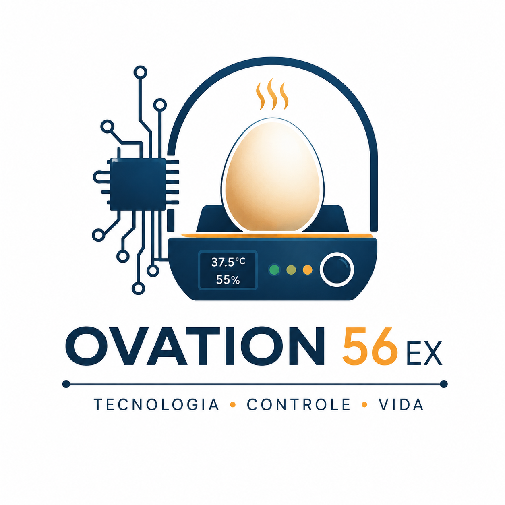

<h1>🐣 Incubadora Inteligente</h1>

Firmware em ESP32 · ESP-IDF

<b>Monitoramento de temperatura e umidade, com controle do aquecedor, alarme e página web.</b>

Esta documentação descreve o firmware da incubadora desenvolvido em <b>ESP32</b> com o
framework <b>ESP-IDF</b>. O foco é direto: mostrar os <b>componentes</b> de hardware
utilizados e onde cada um está ligado na ESP, as <b>funções</b> (tarefas) que compõem o
sistema e o que cada uma faz, e a <b>arquitetura</b> que integra tudo.

 

<a class="md-button md-button--primary" href="02-produto/componentes/">📦 Ver Componentes</a>

<a class="md-button" href="https://github.com/FGA-FSE/Trabalho-3-Mayara-Raquel">GitHub</a>

---

# 📋 Visão Geral

O sistema mede **temperatura** e **umidade** dentro da incubadora, mostra os valores em um
**display OLED** e em uma **página web** (via Wi-Fi), sinaliza o estado com um **LED RGB** e
um **buzzer**, e mantém a temperatura na faixa ideal ligando e desligando um **aquecedor**
através de um **relé**.

Todo o firmware roda sobre o **FreeRTOS**: cada responsabilidade fica em uma *tarefa*
independente, e todas se comunicam por um **estado compartilhado** protegido por *mutex* —
sem variáveis globais soltas.

📦

<h3>Componentes</h3>

Os sensores, atuadores e o display, com o pino da ESP em que cada um está ligado e o que faz.

⚙️

<h3>Funções</h3>

As tarefas do FreeRTOS: leitura dos sensores, controle do aquecedor, alarme, LED e servidor web.

🧩

<h3>Arquitetura</h3>

Como os componentes e as tarefas se organizam em torno do estado compartilhado.

---

# 🚀 Tecnologias

ESP32
ESP-IDF
FreeRTOS
Linguagem C
I²C
PWM (LEDC)
GPIO
Wi-Fi (SoftAP)
Servidor HTTP
BMP280
DHT11
OLED SSD1306

---

# 👩‍💻 Equipe

| 👤 Integrante | 🎓 Matrícula |
|:--|:--:|
| **Mayara Alves** | **200025058** |
| **Raquel** | **202045268** |

> **Universidade de Brasília (UnB)** — Faculdade do Gama (FGA)  
> **Disciplina:** Sistemas Embarcados · **Semestre:** 2026/1  
> **Plataforma:** ESP32 + ESP-IDF
